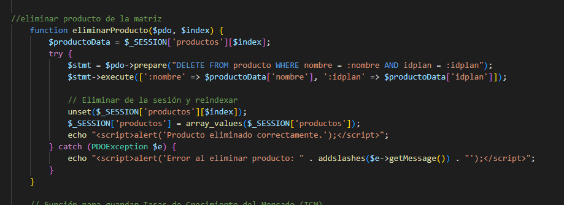
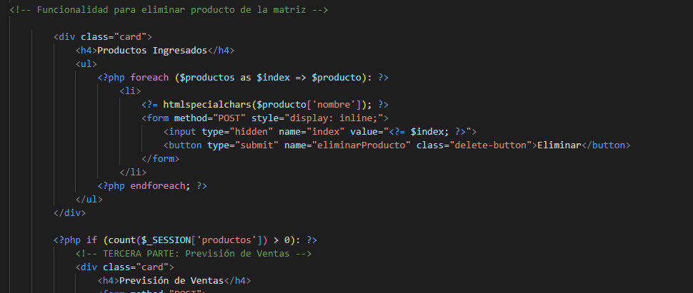
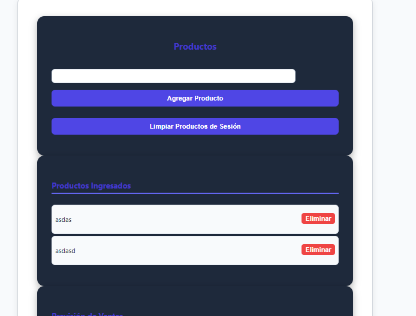
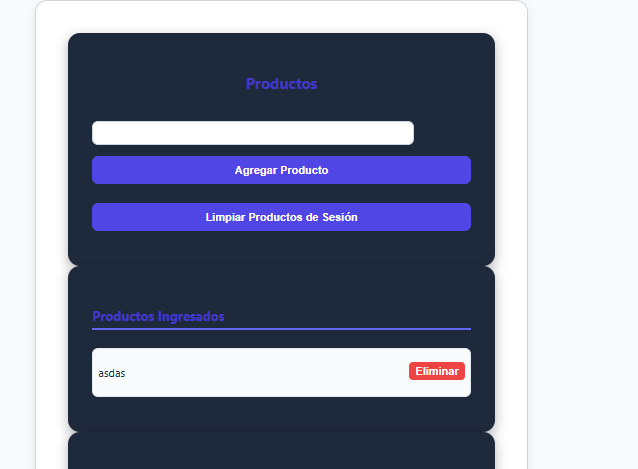
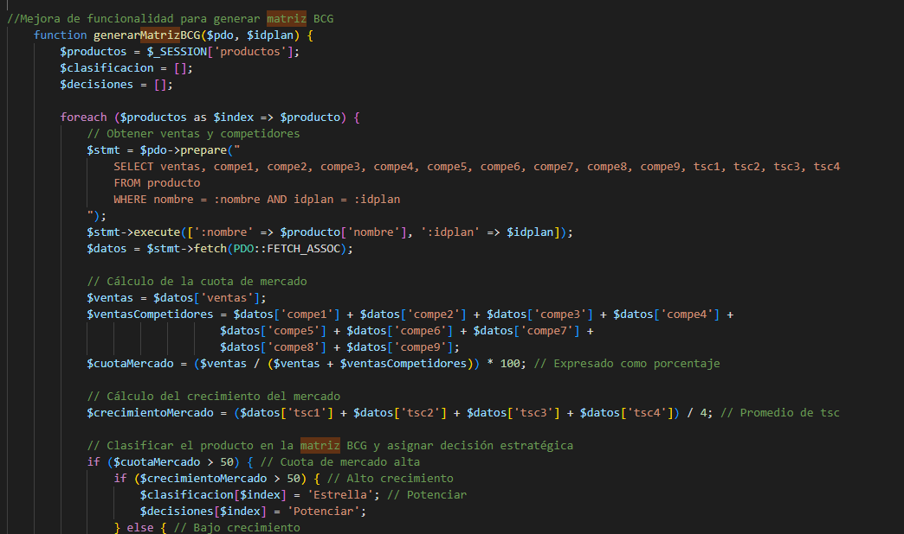
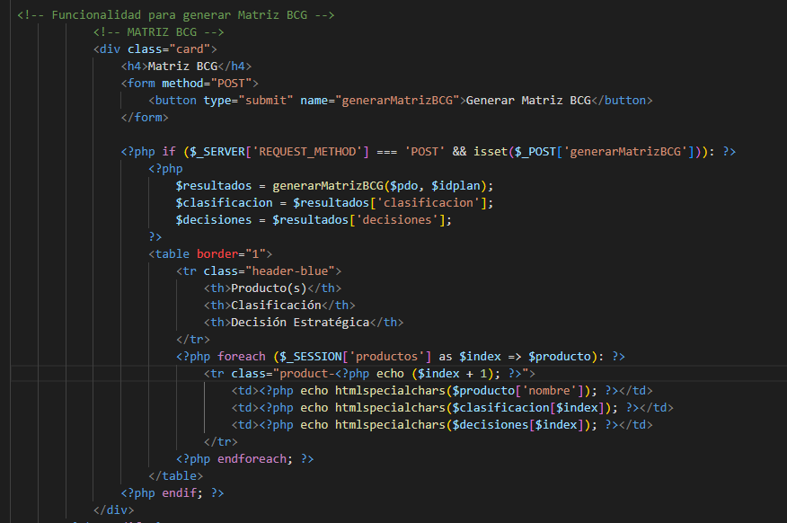
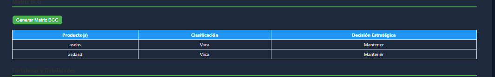
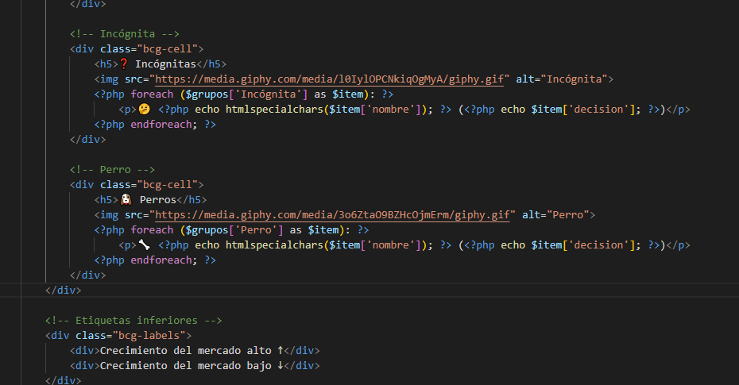
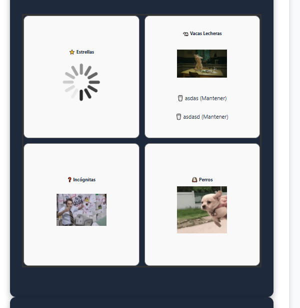

# 🧩 Examen Práctico Unidad II - Sistema PETI

**Alumno:** Camila Fernanda Cabrera Catari  
**Fecha:** 22 de octubre de 2025  
**Repositorio GitHub:** https://github.com/ccabrerastu/PE_II_EXAMEN_PRACTICO

---

## 🗂️ Descripción General del Proyecto

El **Sistema PETI (Plan Estratégico de TI)** es una aplicación desarrollada para la gestión de la planificación estratégica tecnológica dentro de una organización.  
Este sistema permite a los usuarios administrar proyectos, roles, cronogramas, solicitudes de cambio y generar reportes estratégicos para la toma de decisiones.

El examen práctico corresponde al **avance de la Unidad II**, en el cual se han realizado mejoras funcionales y estructurales respecto a la versión anterior.

---

## ⚙️ Mejoras Realizadas

### 🧠 Mejora 1:
📸 **Capturas:**
1. Método eliminarProducto() para quitar de la lista algún producto de los que ingresamos. Usando el id del producto.

Dentro de la función de está recopilando el nombre del producto y a que plan pertenece para que no haya errores. 

2. Dentro de la interfaz matriz.php se agregó una tarjeta, dentro de la tarjeta el botón de eliminar. 

Al botón de eliminar se le agregó la funcionalidad del método mencionado anteriormente. 

3. En la interfaz se visualiza un campo para agregar el producto, debajo un espacio con la lista de productos. 

Cada producto tiene un botón para eliminar. 

4. Ya probando la funcionalidad agregada observamos que se eliminó el segundo producto de la lista. 

Al eliminarse uno de los productos se actualiza el listado. 

### 🧠 Mejora 2:

📸 **Capturas:**

1. Se agregó un método generarMatrizBCG() dentro de esto se realizan los cálculos para poder generar la matriz. 

De esta forma se podrá obtener un resultado para que en la interfaz se genere la matriz con los dibujos respectivos. 

2. Dentro de la interfaz agregué una card para que se pueda visualizar el diagrama o matriz bcg. 

Antes de realizar la mejora pues solo se tenía una tabla pero ahora se agregarán unos íconos.

3. Interfaz antigua con una tabla mencionando el resultado o clasificación. 

En esta parte solo se mencionaba la clasificación.

4. Actualizando la interfaz estamos agregando algunos íconos y gifs para poder represantar la matriz bcg.

Se está añadiendo lo necesario según el resultado que envíe el método. 

5. Finalmente tenemos el resultado, de una matriz con una mejor vista según cada producto. 

Los productos se ubican según el resultado o clasificación que lance el método mencionado anteriormente. Listando el producto en su figura respectiva.

---
